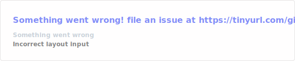
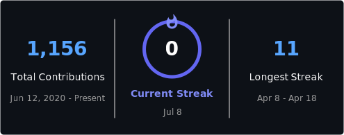

<div align="center">

```
 █████╗ ██╗    ███████╗███╗   ██╗ ██████╗ ██╗███╗   ██╗███████╗███████╗██████╗
██╔══██╗██║    ██╔════╝████╗  ██║██╔════╝ ██║████╗  ██║██╔════╝██╔════╝██╔══██╗
███████║██║    █████╗  ██╔██╗ ██║██║  ███╗██║██╔██╗ ██║█████╗  █████╗  ██████╔╝
██╔══██║██║    ██╔══╝  ██║╚██╗██║██║   ██║██║██║╚██╗██║██╔══╝  ██╔══╝  ██╔══██╗
██║  ██║██║    ███████╗██║ ╚████║╚██████╔╝██║██║ ╚████║███████╗███████╗██║  ██║
╚═╝  ╚═╝╚═╝    ╚══════╝╚═╝  ╚═══╝ ╚═════╝ ╚═╝╚═╝  ╚═══╝╚══════╝╚══════╝╚═╝  ╚═╝
```

### `> whoami --verbose`

**AI Engineer · Cybersecurity · Full Stack Developer**

*Building intelligent, secure systems — LLM pipelines, autonomous agents, and exploit-resistant applications.*

[](https://ragib-ali.netlify.app/)
[](https://www.linkedin.com/in/ragibali/)
[](https://x.com/ragibalikhan5)
[](https://instagram.com/ragib_ali_khan)

</div>

---

## `> cat identity.json`

```json
{
  "name": "Ragib Ali",
  "handle": "ragibalikhan",
  "year": 2026,
  "roles": ["AI Engineer", "Cybersecurity Engineer", "Full Stack Developer"],
  "currently_building": [
    "Multi-agent autonomous systems",
    "Production RAG pipelines",
    "LLM fine-tuning on domain data"
  ],
  "currently_learning": [
    "MCP Protocol (Model Context Protocol)",
    "LLM Red Teaming & AI Security",
    "LoRA / QLoRA fine-tuning",
    "Multimodal AI systems"
  ],
  "philosophy": "Red team the model. Secure the pipeline. Ship the product.",
  "open_to": ["AI Research Collabs", "Freelance AI Engineering", "Open Source AI"]
}
```

---

## `> ls ./ai-stack/ --2026`

### 🧠 LLMs & Foundation Models


### 🤖 Agents & Orchestration


### 🗄️ RAG & Vector Databases


### ⚙️ Training & Fine-tuning


### 🚀 AI Infra & Serving


### 🔐 AI Security & Evals


---

## `> ls ./core-stack/`

### Languages


### Full Stack


### Databases & Cloud


---

## `> cat learning.log`

```
[Q2 2026] >> Multi-Agent Systems & MCP Protocol
           >> Building autonomous agent networks with tool use, memory & planning

[Q1 2026] >> LLM Fine-tuning — LoRA / QLoRA / Unsloth
           >> Domain adaptation & RLHF on consumer hardware

[Q4 2025] >> Production RAG Pipelines
           >> Hybrid search, reranking, guardrails (LlamaIndex + Qdrant + LangGraph)

[Q3 2025] >> AI Red Teaming & LLM Security
           >> Prompt injection, jailbreaks, model fingerprinting & adversarial robustness

[Q2 2025] >> Agentic AI — LangGraph + CrewAI
           >> Tool-calling agents, memory systems, multi-step reasoning loops
```

---

## `> ./stats.sh`
<div align="center">





</div>

---


---

## `> ping ragib --connect`

<div align="center">

*Open to AI research collabs, LLM engineering roles, and building things that matter.*

[](https://ragib-ali.netlify.app/)
[](https://www.linkedin.com/in/ragibali/)
[](https://x.com/ragibalikhan5)

</div>

---

<div align="center">
<sub>

```python
# 2026 motto
agent = AIEngineer(
    skills=["LLMs", "Agents", "RAG", "Security", "Full Stack"],
    mode="autonomous",
    mission="build AI that's powerful, safe, and actually useful"
)
agent.run()  # >> shipping...
```


</sub>
</div>
